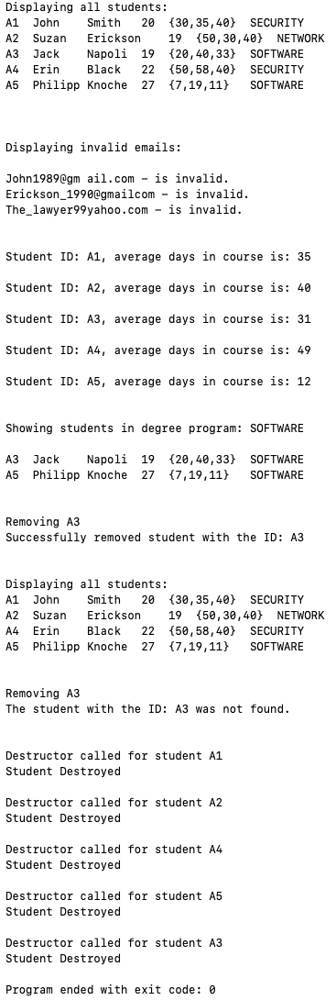

# Student Roster Program

## Description

This is a student roster management program written in C++. It incorporates object-oriented design principles to parse a list of students from csv, add the students to a roster, and perform various functions related to student roster management including:

1. Printing a list of all students
2. Printing students in specific degree programs
3. Calculating and printing the average number of days taken to complete a course
4. Validating email addresses
5. Adding students to the roster
6. Removing students from the roster
7. Editing student information

This program incorporates data structures and constructs such as arrays, enumerations, pointers, loops, header files, and dynamic memory management.

The program is currently command-line based, but could be incorporated into a GUI in the future. The output of the program after calling roster.Parse(), roster.PrintAll(), roster.PrintAverageDaysInCourse(), roster.PrintByDegreeProgram(), roster.Remove(), roster.PrintAll() (for a second time after removing a student), and roster.Remove() (for a second time after attempting to remove a student no longer on the roster) is displayed in the following screenshot:

